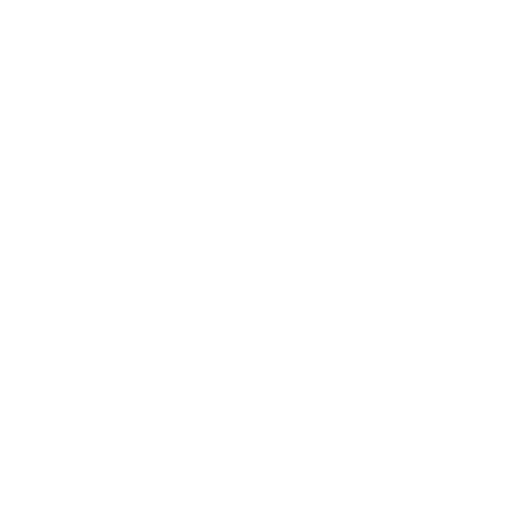

<h3>About Me</h3>

&nbsp;&nbsp;&nbsp;&nbsp;"Not only are we in the universe, the universe is in us". One of many beautiful, philosophical, and reflective quotes from my astrophysicist friend Neil deGrasse Tyson. In this sentence, Neil explains how, even though your body is young,
the atoms that compose your body are billions of years old, forged in the heart of the stars. Discoveries like that make me fell in love with science, a science that makes us reflect
on who we are and what life is.

&nbsp;&nbsp;&nbsp;&nbsp;Knowing I wanted to transform this passion into a way of living, i studied computer science, which i felt particularly close to since childhood. The algorithms, the processing,
and manipulation of data to help science expand. With these things i said i have a certain intimacy, i probably give a spoiler of what my area is: computer organization. The way that
we design a circuit to process and manipulate data using logic gates and electronic signs is, to me, an interesting and fun puzzle that, sometimes, makes me lose sanity in the early mornings 🙃.

&nbsp;&nbsp;&nbsp;&nbsp;Last but not least, welcome to my profile 😺. Where you can find my projects on computer organization focused on improving teaching, learning, and expanding science, among other nice things.
Make yourself at home.

<h3>My Languages</h3>

 
  
  
  
  
  
  
  
  

<h3>Learning Languages</h3>

 
  
  
  
  
  
  

