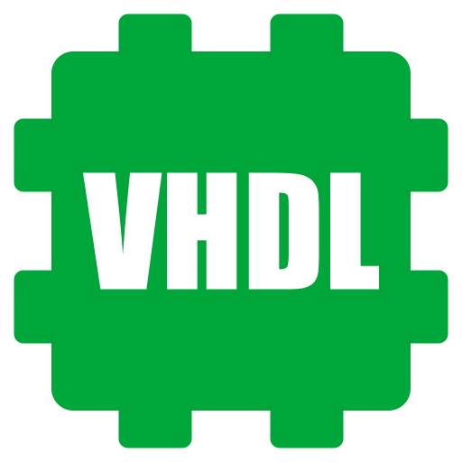

  <h1>Welcome to my GitHub 👽</h1>

<!-- ## My Projects -->

## Projects in Development

  <table>
    <tbody>
      <tr>
        <td>
          
        </td>
        <td>A friendly HDL and Python framework for hardware design and simulation.</td>
      </tr>
      <tr>
        <td>
          
        </td>
        <td>A Powerful 16-bit, RISC, multicore, pipelined, processor architecture.</td>
      </tr>
      <tr>
        <td>
          
        </td>
        <td>A minimal C like programming language.</td>
      </tr>
    </tbody>
  </table>

## My Skills

  
  
  
  
  
  
  
  
  
  
  
    <!-- Local -->

## My Stats

  
  

